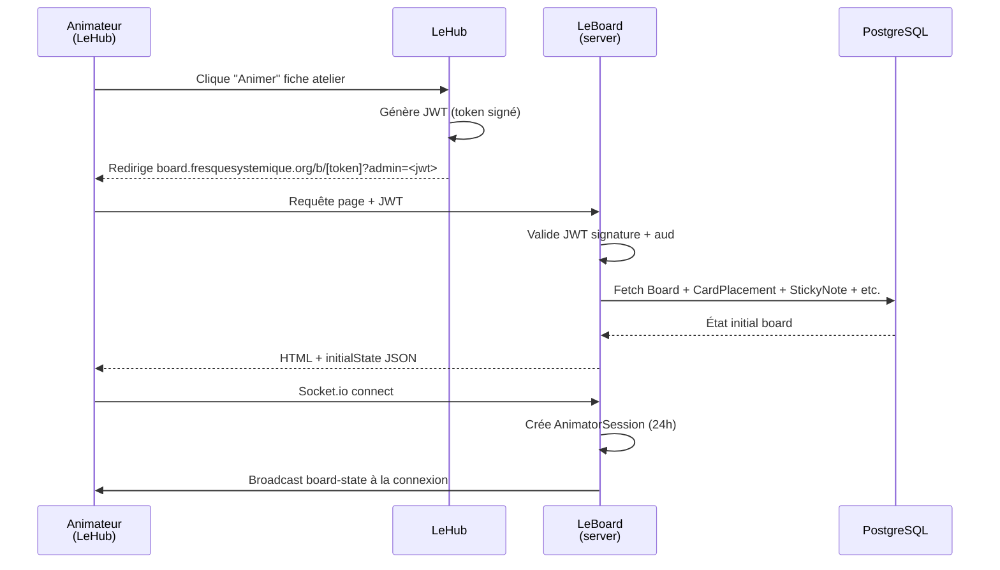
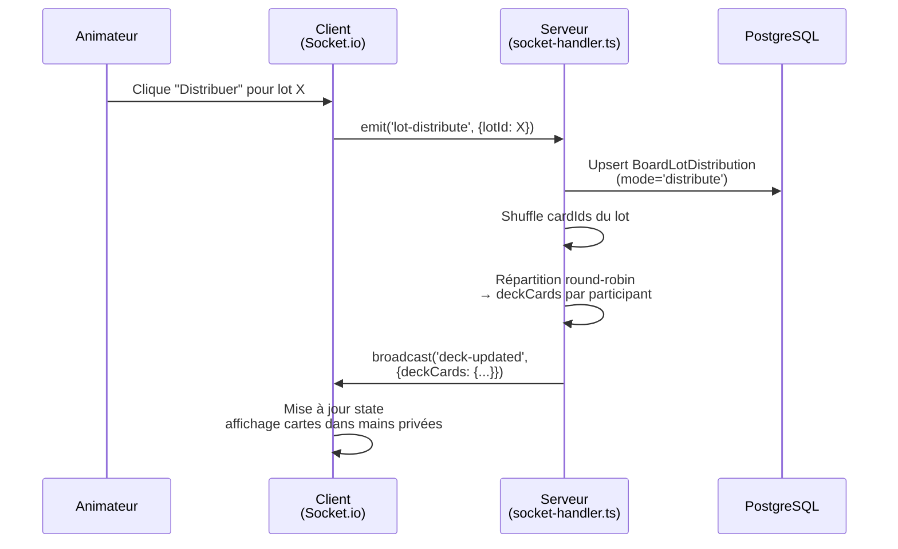
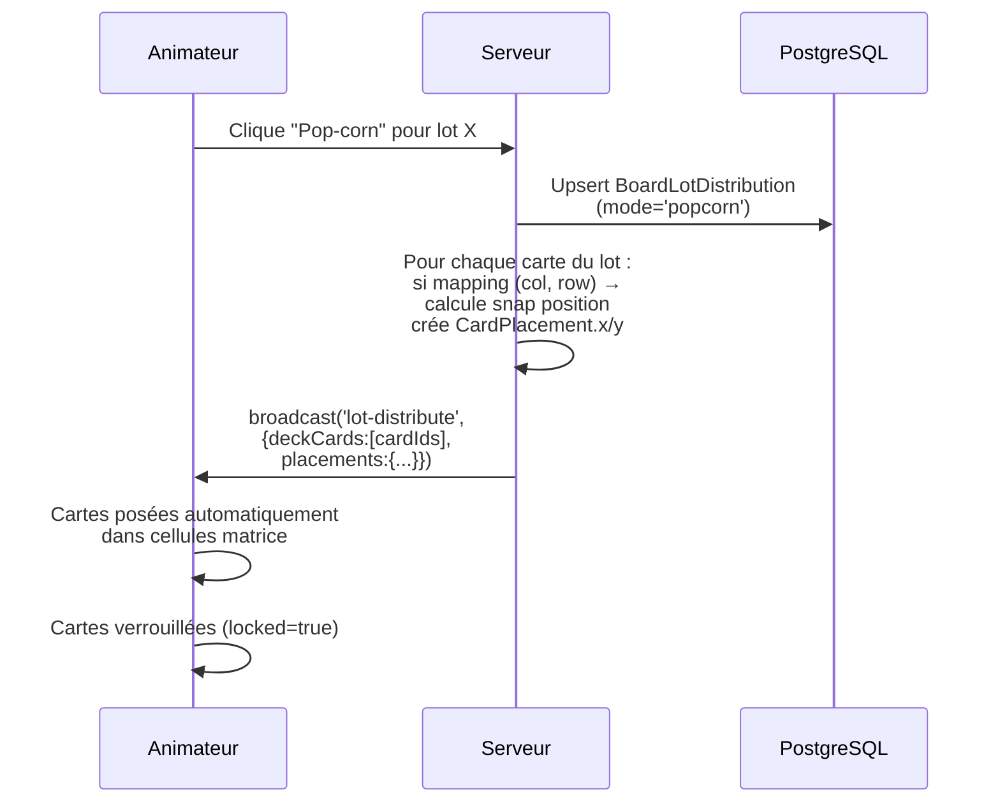
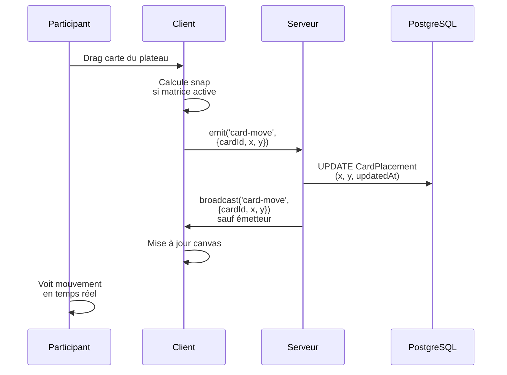

# Flux métier

Les workflows critiques du Board : lancement d'atelier, distribution et gestion des lots, undo/redo, collaboration temps réel.

## Lancement d'atelier et chargement initial

**Détails** :
1. Animateur clique le bouton « Animer » dans la fiche atelier LeHub.
2. Le Hub génère un JWT signé avec `BOARD_ADMIN_JWT_SECRET`, inclut `aud: 'board-admin'` et l'ID animateur.
3. Redirection vers `https://board.fresquesystemique.org/b/[token]?admin=<jwt>`.
4. LeBoard fetch l'état initial via `GET /api/board/[token]` (validation JWT + board access).
5. Rendu page React avec état initial (cartes, post-its, étape active, etc.).
6. Socket.io connect depuis le client → création `AnimatorSession` côté serveur (durée 24h).
7. Broadcast `board-state` à la connexion pour synchroniser l'état avec tous les participants actuels.

## Participant rejoint le plateau

1. Participant reçoit/clique URL publique `https://board.fresquesystemique.org/b/[token]`.
2. LeBoard valide le token (lookup Board par token).
3. Page charge avec l'état initial board (cartes déjà posées, post-its, étape masquée).
4. Modal `PseudoModal` demande le pseudo (ou utilise pseudo stocké localement).
5. Socket.io connect → broadcast `board-state` à la connexion pour synchroniser l'état, affichage pseudo + curseur.

## Distribution lot (Distribuer)

**Détails** :
1. Animateur clique « Distribuer » pour un lot depuis le `LotPanel`.
2. Émission Socket `lot:distribute` avec l'ID lot.
3. Serveur :
   - Récupère le lot du Hub (cardIds JSON).
   - Upsert `BoardLotDistribution` avec `mode='distribute'`.
   - Mélange aléatoire des cardIds.
   - Répartition round-robin : participant 1 reçoit cartes 1,3,5,… / participant 2 reçoit 2,4,6,…
   - Chaque participant a sa pioche unique (invisible des autres).
4. Broadcast `lot:distributed` avec payload `{[participantId]: [cardIds]}` (chiffré par socket room).
5. Chaque participant voit ses cartes dans le `DeckPanel` (bas écran, max 5 visibles).

## Lancement lot (Pop-corn)

**Détails** :
1. Animateur clique « Pop-corn » pour un lot avec matrice (ex: étape "Système A").
2. Serveur upsert `BoardLotDistribution` avec `mode='popcorn'`.
3. Pour chaque carte du lot avec mapping matrice (col, row) :
   - Récupère la cellule correspondante.
   - Calcule position de snap (`snap-to-grid` via `findSnapPosition()`).
   - Crée/met à jour `CardPlacement` avec (x, y) calculées.
4. Broadcast `lot-distribute` avec liste cardIds et placements.
5. Animateur voit les cartes auto-posées dans la grille, verrouillées.
6. Les cartes restent dans la main de l'animateur jusqu'à révélation manuelle au clic (toggle `hidden`).

## Déplacement carte (drag-drop)

**Détails** :
1. Participant drag une carte depuis le plateau.
2. Calcul optionnel de snap (si la carte doit rester dans une cellule de matrice).
3. Émission `card-move` avec (cardId, x, y).
4. Serveur UPDATE la `CardPlacement` en DB.
5. Broadcast `card-move` à tous les autres (le client émetteur anticipe via optimistic update, donc pas de re-broadcast).
6. Affichage temps réel (~< 100ms latence socket).

## Émergences indésirables

Certains lots sont marqués `kind='emergence'` au Hub. Leurs cartes s'ancrent à une carte de base déjà posée.

1. Lot "Émergence Actions" lancé en pop-corn.
2. Chaque carte du lot a un `emergenceSlot` (1 ou 2) et un `anchorCardId`.
3. Serveur calcule position d'émergence via `emergencePosition(anchorCard)` + slot offset.
4. Cartes s'ancrent à la carte base et la suivent en cas de déplacement.
5. Si carte base déplacée → `card:moved` émis → serveur recalcule toutes les émergences liées et broadcast.

## Flèches de causalité

### Mode lien classique (Connection)

1. Animateur/participant active l'outil Flèche.
2. Clique sur anchorpoint de carte A → `arrowDraft` state.
3. Clique sur anchorpoint de carte B → création `Connection` en DB.
4. Broadcast `arrow:created` → rendu KonvaArrow ligne droite.

### Mode flèche avancée (BoardArrow)

1. Pareil, mais crée un `BoardArrow` avec couleur/direction/strokeWidth.
2. Supprimer flèche : clic droit → `arrow:delete` → suppression `Connection` ou `BoardArrow`.

## Undo/Redo

### Historique animateur (global)

1. Animateur fait action (déplacer carte, créer post-it, etc.).
2. Changement enregistré en mémoire dans `undoStack` (serveur Socket.io).
3. Clique Ctrl+Z → serveur cherche l'action précédente, la réverse, broadcast aux autres (lecture seule).

**Note** : l'undo global animateur impacte le state serveur (vérité), broadcast aux participants qui voient le changement.

### Historique participant (personnel)

1. Participant fait action.
2. Changement enregistré localement (pas de broadcast serveur).
3. Ctrl+Z → socket `undo:personal` → serveur marque comme "local-undo" (pas broadcast).
4. Le changement est annulé localement seulement.

**Remarque** : LeBoard n'a pas (encore) d'historique persistant stocké en BD. L'undo/redo vit en mémoire serveur et es perdu au redéploiement. C'est acceptable pour un atelier qui dure 2-3h.

## Étape active et forçage suivi

### Animateur change l'étape

1. Animateur clique l'étape suivante dans `BottomNav`.
2. Socket `stage-change` → serveur update `Board.activeStageId`.
3. Broadcast `stage-change` à tous pour synchroniser l'étape active.
4. **Suivi de viewport** (optionnel) : animateur peut envoyer `viewport-change` avec ses coordonnées zoom/pan → les participants en suivi reçoivent et adaptent leur viewport.

### Participant suit l'animateur (volontaire)

1. Participant clique pseudo de l'animateur dans `ParticipantBar` → émet `start-follow` (pseudo de l'animateur).
2. Serveur broadcast `start-follow` à tous.
3. À chaque `viewport-change` de l'animateur → les followers s'alignent.
4. Reclique pseudo pour arrêter (`stop-follow`).

## Réinitialisation plateau

1. Animateur clique bouton Réinitialiser (reset).
2. Socket `board-reset` → serveur efface l'état temps réel (cartes, post-its, étape).
3. Broadcast `board-reset` à tous.
4. Plateau revient à l'état vide, prêt pour un nouvel atelier.

## Collaboration temps réel (Socket.io)

### Gestion des connexions

- `connection` (`join` émis) : création AnimatorSession (si JWT valide) ou simple user join.
- `disconnection` : suppression `AnimatorSession`, suppression de l'utilisateur de la liste des participants.
- Timeout inactivité : 24h → auto-suppression `AnimatorSession`.

### Événements clés

| Événement | Émetteur | Récepteur | Payload |
|-----------|----------|-----------|---------|
| `join` | Client | Serveur | `{pseudo, role, avatarUrl, authSessionId}` |
| `card-move` | Client | Serveur | `{cardId, x, y}` |
| `card-move` | Serveur | Clients | `{cardId, x, y}` (broadcast) |
| `card-flip` | Client | Serveur | `{cardId, flipped}` |
| `card-flip` | Serveur | Clients | `{cardId, flipped}` (broadcast) |
| `card-drag-start` | Client | Serveur | `{cardId, pseudo}` |
| `card-drag-end` | Client | Serveur | `{cardId}` |
| `card-drag-end` | Serveur | Clients | `{cardId}` (broadcast) |
| `card-placed` | Client | Serveur | `{cardId, x, y, flipped, zIndex}` |
| `arrow-add` | Client | Serveur | `{fromId, toId, fromAnchor, toAnchor, ...}` |
| `arrow-add` | Serveur | Clients | Données flèche créée (broadcast) |
| `arrow-update` | Client | Serveur | `{arrowId, ...updates}` |
| `arrow-update` | Serveur | Clients | Données flèche modifiée (broadcast) |
| `arrow-delete` | Client | Serveur | `{arrowId}` |
| `arrow-delete` | Serveur | Clients | `{arrowId}` (broadcast) |
| `lot-distribute` | Client (animateur) | Serveur | `{lotId}` |
| `deck-updated` | Serveur | Clients | `{[participantId]: [cardIds]}` |
| `lot-correct-hands` | Serveur | Clients | Correction distribution mains |
| `deck-assigned` | Serveur | Clients | `{participantId, cardIds}` |
| `board-reset` | Client (animateur) | Serveur | `{}` |
| `board-state` | Serveur | Client | État complet du plateau (connexion) |
| `cursor-move` | Client | Serveur | `{pseudo, x, y}` (throttlé) |
| `cursor-move` | Serveur | Clients | `{pseudo, x, y}` (broadcast) |
| `start-follow` | Client | Serveur | `{pseudo}` |
| `start-follow` | Serveur | Clients | `{pseudo}` (broadcast) |
| `stop-follow` | Client | Serveur | `{}` |
| `stop-follow` | Serveur | Clients | `{}` (broadcast) |
| `slides-present` | Client (animateur) | Serveur | `{lotId}` |
| `slides-present` | Serveur | Clients | `{lotId, slides: [...]}` (broadcast) |
| `slides-navigate` | Client | Serveur | `{index}` |
| `slides-navigate` | Serveur | Clients | `{index, pointer: {x, y}}` (broadcast) |
| `slides-pointer` | Client (animateur) | Serveur | `{x, y}` |
| `slides-pointer` | Serveur | Clients | `{x, y}` (broadcast) |
| `slides-close` | Client | Serveur | `{}` |
| `slides-close` | Serveur | Clients | `{}` (broadcast) |
| `undo` | Client (animateur) | Serveur | `{}` |
| `undo` | Serveur | Clients | Action inversée (broadcast) |
| `redo` | Client (animateur) | Serveur | `{}` |
| `redo` | Serveur | Clients | Action réexécutée (broadcast) |
| `role-downgraded` | Serveur | Client | `{reason: 'session-invalid' \| 'no-session'}` |

**Convention** : les événements émis par le client vers le serveur déclenchent un broadcast du serveur aux autres clients avec le même nom ou une variante (ex: `card-move` côté client → `card-move` broadcast aux autres). Voir `socket-handler.ts` pour le détail de chaque handler.

## Diapositives (SlideOverlay)

1. Lot marqué `contentType='slides'` lancé en pop-corn.
2. Serveur parse `Lot.slidesData` (JSON images + notes).
3. Client affiche `SlideOverlay` fullscreen.
4. Navigation : flèches gauche/droite, clic numéro slide.
5. Pointeur partagé : position souris de l'animateur visible à tous.
6. Broadcast `slides:navigate` → mise à jour index + pointeur.
