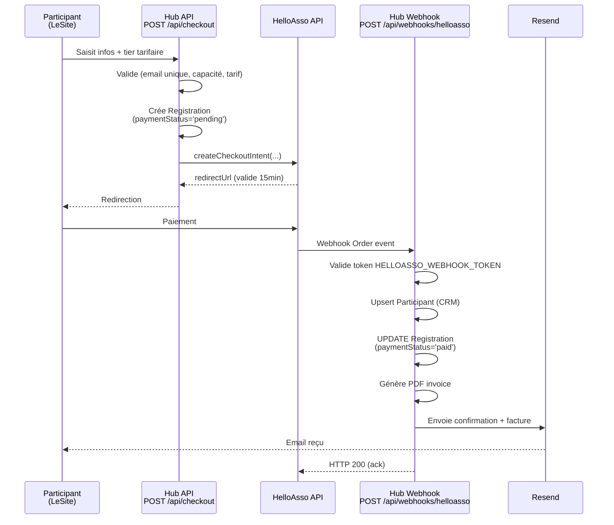
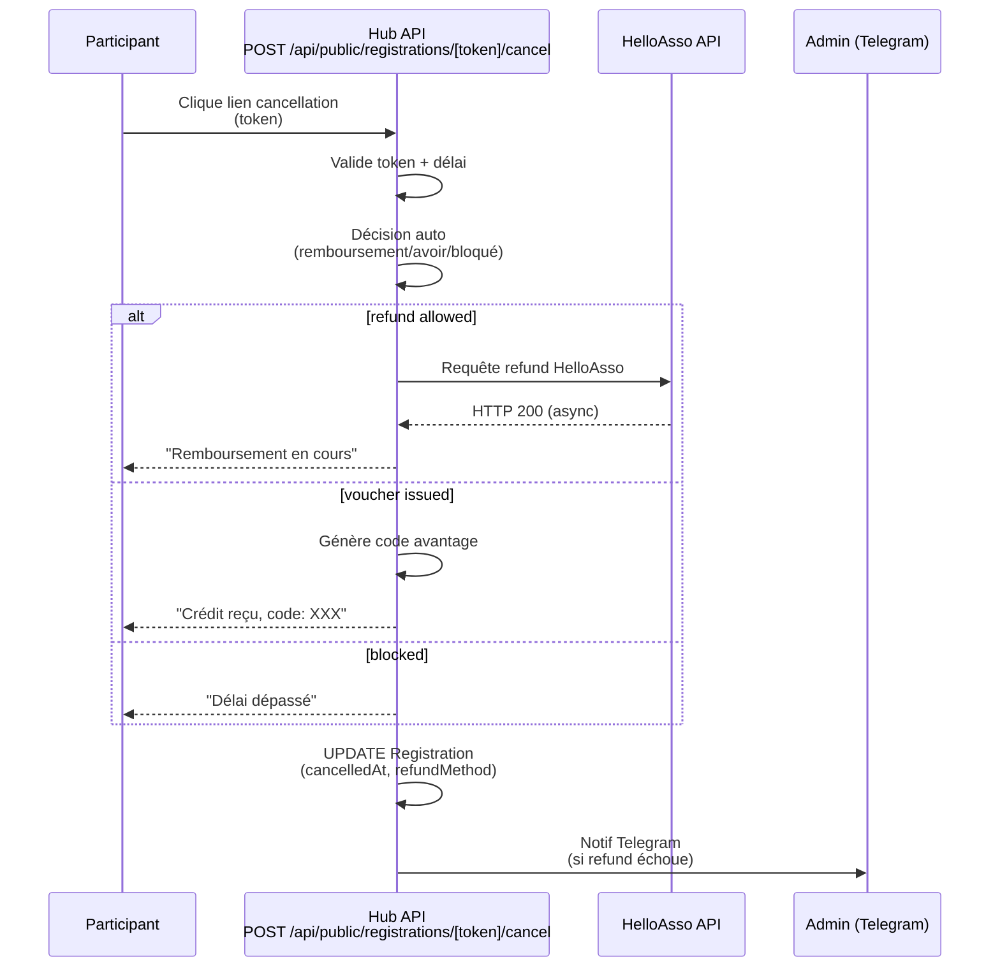
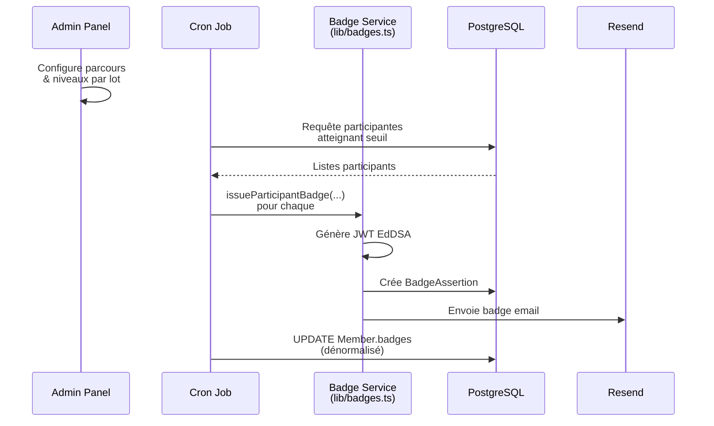
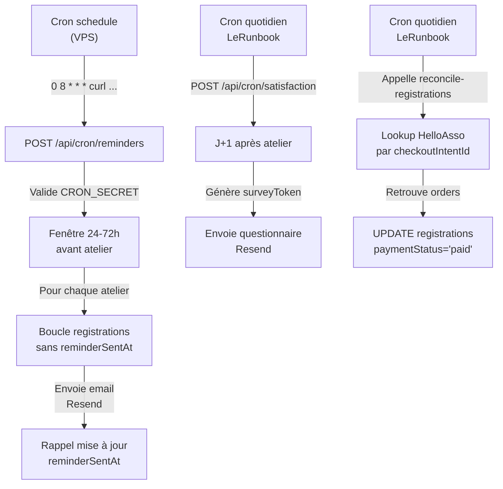
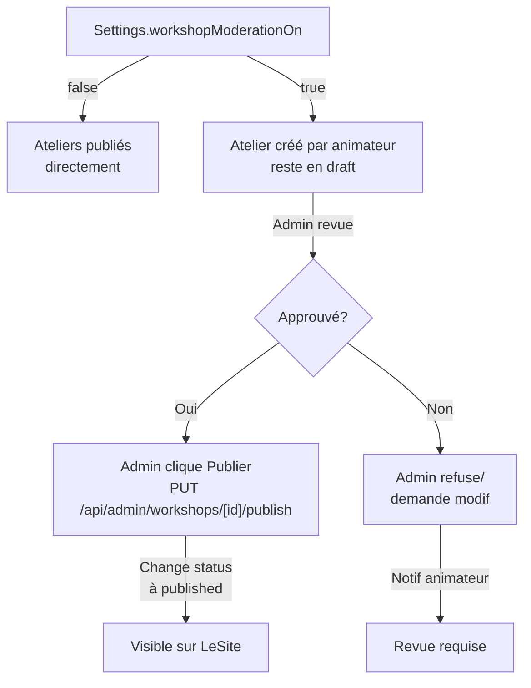

# Flux métier

Les workflows critiques du Hub : inscription + paiement, annulation + remboursement, attribution des badges, tâches planifiées et modération.

## Inscription, paiement et webhook HelloAsso



**Étapes détaillées** :

1. **Saisie inscription** (`app/(inscription)/checkout/`) : formulaire capture prénom, nom, email, téléphone (opt), sélection tier tarifaire (solidaire/classique/soutien).

2. **Validation** (`app/api/checkout/route.ts`, ligne 31 sqq) :
   - Rate limit par IP (10 requêtes / 10 min, `lib/rate-limit.ts`).
   - Vérification email unique (pas encore inscrit avec `paymentStatus='paid'`).
   - Vérification capacité restante (`workshop.capacity - count registrations payées`).
   - Vérification tarif valide pour `targetPublic` de l'atelier.
   - Vérification ateliers futurs seulement.

3. **Création intention de paiement** (`createCheckoutIntent()` dans `lib/helloasso.ts`) :
   - Token OAuth2 HelloAsso (credentials flow, cachés en mémoire).
   - POST `/v5/checkout-intents` avec détails.
   - Retour `redirectUrl` valide 15 min.

4. **Création Registration** :
   - Une `Registration` avec `paymentStatus='pending'`, `helloassoCheckoutIntentId`, `cancellationToken` généré.
   - L'email et le workshop ID sont uniques ensemble (`@@unique([workshopId, email])`).

5. **Redirection vers HelloAsso** : l'app redéploie vers `redirectUrl`.

6. **Paiement** : l'utilisateur paie chez HelloAsso, qui redirige vers `returnUrl?checkoutIntentId=xxx&code=succeeded&orderId=yyy`.

7. **Webhook HelloAsso** (`app/api/webhooks/helloasso/route.ts`) :
   - Valide le token en query string (`?token=HELLOASSO_WEBHOOK_TOKEN`).
   - Extrait `checkoutIntentId` de `data.checkoutIntentId` ou `data.formSlug`.
   - Cherche toutes les `Registration` en attente (`paymentStatus='pending'`) pour ce checkout.
   - Pour chaque registration :
     - Upsert `Participant` par email (CRM).
     - UPDATE `Registration` : `paymentStatus='paid'`, lien `participantId`.
     - Génère PDF facture.
     - Appel Resend pour envoi email confirmation + PDF.
   - Idempotence : si `orderId` déjà traité, retour 200 immédiate.

**Si le webhook est perdu** :

- Le participant paie mais reste en `paymentStatus='pending'` côté Hub.
- **Réconciliation quotidienne** (job cron, voir LeRunbook) : script `reconcile-registrations.ts` qui requête HelloAsso par `checkoutIntentId` stocké, retrouve les ordres et met à jour.
- Conséquence : participant n'a pas l'email de confirmation jusqu'au rattrapage.

## Annulation et remboursement



**Étapes détaillées** :

1. **Lien annulation** : l'email de confirmation contient un lien `https://hub.fresquesystemique.org/api/public/registrations/[cancellationToken]/cancel/` (voir `lib/email-template-defaults.ts`).

2. **Endpoint annulation** (`app/api/public/registrations/[token]/cancel/route.ts`) :
   - Rate limit par IP (10 tentatives / 15 min).
   - Trouve `Registration` par `cancellationToken`.
   - Appelle `cancelRegistration(registrationId)` (`lib/registration-cancellation.ts`).

3. **Logique décision** (`lib/registration-cancellation.ts`) :
   - Lit `cancellationPolicy` (`lib/cancellation-policy.ts`) — délais par événement type.
   - Calcule si annulation encore possible : `workshop.date - 48h` > maintenant ?
   - **Remboursement** : délai ok + paiement accepté → appel HelloAsso refund (async).
   - **Avoir** : délai ok + paiement accepté + refund échoue → génère code avantage unique.
   - **Blocage** : délai dépassé → refuse l'annulation (contact admin requis).

4. **Appel HelloAsso refund** :
   - Requête HelloAsso `POST /v5/refund` (en attente du privilège `RefundManagement`).
   - Actuellement **désactivé** (`Settings.helloassoRefundEnabled=false`) → la refund passe par une **notif Telegram admin** pour traitement manuel.
   - Admin doit refunder manuellement dans l'interface HelloAsso, puis marquer en DB.

5. **Code avantage émis** : `DiscountCode` créé avec `amountOffTTC` égal au montant inscrit, `maxUses=1`, `restrictedToEmail` du participant.

6. **Mise à jour Registration** : `cancelledAt=now()`, `refundMethod` = 'refund' / 'voucher' / 'blocked'.

**Gestion de l'atelier annulé** :

- Admin peut annuler tout un `Workshop` → tous les inscrits payés sont refundés automatiquement.
- Atelier en état `cancelled` : inscrits visibles (lecture seule), animateurs non éditables, atelier non modifiable.

**Si le refund HelloAsso échoue** :

- Notif Telegram admin (via `notifyAdmin()` dans `lib/notifications.ts`).
- Participant voit un message d'erreur mais inscription reste `paid`.
- Admin traite manuellement et met à jour le statut en DB.

## Attribution des badges



**Types de badges** (`lib/badges.ts`) :

| Type | Rôle | Prérequis |
|------|------|-----------|
| `ANIMATOR_PUBLIC` | Animateur grand public | Animateur habilité grand public |
| `ANIMATOR_PRO` | Animateur professionnel | Animateur avec habilitation professionnelle |
| `TRAINER_PUBLIC` | Formateur grand public | Formateur habilité grand public |
| `TRAINER_PRO` | Formateur professionnel | Formateur avec habilitation professionnelle |
| `PARTICIPANT` | Participant | 1+ atelier suivi |

**Émission** :

1. **Par atelier** : cron quotidien (après chaque atelier) requête `WorkshopAnimator` + participants ayant assisté.
2. **Par habilitation** : admin page `/admin/members` attribue `habilitationAnimation`/`habilitationFormation` → badges générés en masse.
3. **Fonction centrale** : `issueParticipantBadge(memberId, badgeType)` qui :
   - Crée un UUID v7 comme `id`.
   - Génère un JWT EdDSA signé (clé privée de `BADGE_PRIVATE_KEY`, voir `lib/badge-keys.ts`).
   - Structure VerifiableCredential OB3 : type, recipientEmail, issuedAt, credentialSubject, proof.
   - Crée une `BadgeAssertion` en DB.
   - Envoie email avec lien badge public.

**Format badge JWT** (VerifiableCredential OB3) :

```json
{
  "iss": "https://hub.fresquesystemique.org",
  "sub": "badge-uuid",
  "aud": "https://w3c-ccg.github.io/vc-api/",
  "exp": ...,
  "iat": ...,
  "vc": {
    "type": ["VerifiableCredential", "OpenBadgeCredential"],
    "credentialSubject": {
      "type": "AchievementSubject",
      "achievement": {
        "id": "https://hub.fresquesystemique.org/badges/[type]",
        "type": "Achievement",
        "name": "Animateur·ice citoyen·ne de la Fresque Systémique",
        "criteria": "..."
      },
      "name": "Prénom Nom"
    }
  }
}
```

**Vérification** (`app/verify/page.tsx`) : saisie d'un ID badge → affichage avec QR code, lien vérification en ligne.

## Les tâches planifiées (crons)



**Cron : Rappels J-2** (`app/api/cron/reminders/route.ts`) :

1. **Déclenchement** : appel quotidien depuis le VPS via `curl -H "Authorization: Bearer $CRON_SECRET"` (voir `.env.example`).
2. **Protection** : vérifie `CRON_SECRET` en header `Authorization: Bearer`.
3. **Fenêtre** : ateliers avec `date` entre maintenant+24h et maintenant+72h.
4. **Traitement** :
   - Récupère les `Registration` payées sans `reminderSentAt`.
   - Pour chaque : envoie email rappel (template `rappel_atelier`) avec date/lieu/horaire en timezone de l'atelier.
   - UPDATE `reminderSentAt=now()` pour dédupliquer (même atelier reste dans la fenêtre plusieurs jours).
5. **Gestion du genre** : applique le genre du membre pour «Chère/Cher» etc. via `applyGender()` (fallback neutre si pas de compte membre).
6. **En cas d'erreur** : log et continue (ne bloque pas les autres). Notif Telegram admin si plusieurs erreurs d'envoi.

**Cron : Questionnaire satisfaction** (LeRunbook, non visible ici) :

1. Ateliers terminés (date + duration < maintenant).
2. J+1 : génère un `surveyToken` unique pour chaque `Registration`.
3. Envoie `surveySentAt=now()`.
4. Lien email pointe vers `/satisfaction/[token]` (page publique `app/(fullscreen)/satisfaction/[token]/page.tsx`).
5. Collecte réponses JSON dans `SatisfactionResponse.answers`.
6. Résultats agrégés (NPS, commentaires) visibles sur la fiche atelier pour l'animateur responsable.

**Cron : Réconciliation inscriptions** (LeRunbook, script `reconcile-registrations.ts`) :

1. Quotidien.
2. Récupère toutes les `Registration` en `paymentStatus='pending'`.
3. Pour chaque, appelle HelloAsso `getCheckoutIntent(helloassoCheckoutIntentId)`.
4. Si `checkoutIntent.order` existe (paiement accepté), récréé le flux webhook (upsert Participant, UPDATE registration, envoi email).
5. Déduplique sur `helloassoOrderId` pour éviter double-traitement.

**Cron : Réconciliation rapports utilisation** (LeRunbook, script `reconcile-usage-reports.ts`) :

1. Similaire à ci-dessus pour `UsageReport` en `paymentStatus='pending'`.

## Modération des contenus



**Modération** :

- Flag global `Settings.workshopModerationOn` bascule le mode.
- **Mode off** (défaut) : animateurs publient directement (`status='published'`), atelier visible immédiatement.
- **Mode on** : ateliers créés par animateur restent en `draft`, admin doit cliquer « Publier » pour changer à `published`.
- Endpoint publication : `PUT /api/admin/workshops/[id]/publish` (gating `requireAdmin()`).
- Ateliers figés : une fois un atelier `cancelled`, ses inscrits restent visibles en lecture seule (pour historique).

**CRM modération** :

- Admin `/admin/participants` modère les notes et étiquettes des participants (notes internes, tags texte libre).
- Anonymisation RGPD : soft delete sur `Participant` puis suppression définitive après délai légal.

**Articles modération** :

- Admin `/admin/blog` crée articles en `published=false` (draft).
- Click « Publier » → `published=true` + `publishedAt=now()`.
- Revalidation ISR LeSite sur publication (push de revalidation secret vers LeSite `/api/revalidate`).
