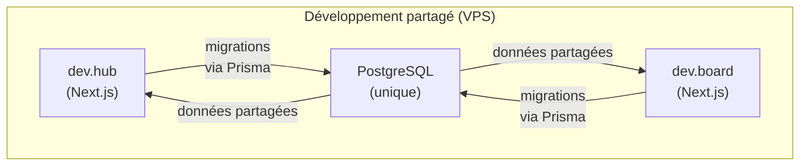

# Environnements

Le SI dispose de deux environnements de déploiement : **production** (le vrai service accessible aux utilisateurs) et **développement partagé** (pour tester les features avant production).

## Production

L'environnement de production est le serveur de référence, accessible 24/7 par les utilisateurs et les animations d'ateliers.

### Domaines
- LeHub : `hub.fresquesystemique.org`
- LeSite : `fresquesystemique.org` (apex)
- LeBoard : `board.fresquesystemique.org`

### Base de données
- Instance PostgreSQL dédiée, entièrement isolée de celle du développement.
- Sauvegarde régulière automatique vers stockage objet (voir [Sauvegardes](./sauvegardes.md)).
- Migrations appliquées automatiquement lors de chaque déploiement.

### Déploiement
- **Déclencheur** : tout push vers la branche `main` (LeHub), `master` (LeBoard) ou `main` (LeSite).
- **Workflow** : CI/CD GitHub Actions (typecheck, linting, tests) → SSH au serveur → pull du code → docker compose build/up → prisma migrate deploy.
- **Durée** : 5-10 minutes environ.
- **Détail du déploiement** : chaque application détaille son pipeline dans sa section Déploiement (voir [LeHub](../lehub/deploiement.md), [LeSite](../lesite/deploiement.md), [LeBoard](../leboard/deploiement.md)).

### Variables d'environnement
Stockées de manière sécurisée sur le serveur (`.env` local, secrets GitHub Actions). Consulter LeRunbook pour les accès.

## Développement partagé (dev.hub et dev.board)

Un environnement de développement **partagé** existe sur le VPS pour tester les features en condition proche-prod avant déploiement en production.

### Principe fondamental

L'environnement de dev repose sur une **base de données PostgreSQL unique et partagée entre dev.hub et dev.board**. Toute migration appliquée d'un côté affecte immédiatement l'autre.



### Domaines
Les deux apps sont routées par le vrai serveur Nginx avec des URLs hardcodées pour le routage.

### Base de données partagée
- **Schéma unique** : dev.hub et dev.board lisent/écrivent sur la même base.
- **Migrations** : les migrations Prisma d'un repo affectent immédiatement l'autre. Si dev.hub applique une migration qui ajoute une colonne à `Workshop`, dev.board verra cette colonne dès sa prochaine requête.
- **Données** : les données créées par une app (ateliers, participants) sont visibles par l'autre.
- **Piège majeur** : un développeur peut appliquer une migration dev.hub qui casse le schéma dev.board en déploiement; une autre peut casser des tests LeBoard. Toujours coordonner les migrations avant deployment.

### Déploiement vers dev
Poussé sur une branche dédiée (`dev`), qui déclenche une CI/CD similaire à la production mais vers l'environnement dev.

### Utilité
- Tester une feature complexe (ex: modification du modèle Workshop) en condition proche-prod avant un déploiement production.
- Vérifier les interactions entre LeHub, LeBoard et LeSite.
- Tester les webhooks HelloAsso (intégration sandbox).
- Acceptation par un stagiaire ou un contributeur avant review maintaineur.

## Développement local

### Installation
Chaque repo contient un `docker-compose.yml` et un `.env.example` pour lancer un environnement local complet :

```bash
git clone https://github.com/fresquesystemique/LeHub.git
cd LeHub
cp .env.example .env.local
npm install
docker compose up -d postgres
npx prisma migrate dev
npm run dev
```

Apps locales tournent sur `localhost:3000` (LeHub), `localhost:3001` (LeSite), `localhost:3002` (LeBoard).

### Base de données locale
Chaque dev a sa propre instance PostgreSQL Docker, indépendante des autres.

### Variables d'environnement
`.env.local` (Git-ignoré) contient les secrets locaux, les tokens dev HelloAsso, etc. Voir le fichier `.env.example` dans chaque repo pour le modèle.

### Cache navigateur et ISR
LeSite utilise la régénération statique incrémentale (ISR) avec un cache de 5 minutes. En local, Ctrl+Shift+R force le rechargement des assets.

## Cohérence entre environnements

### URLs codées en dur
Certaines URLs sont codées en dur dans les trois apps pour le routage en production :

- Nom du cookie de session : `AUTH_SESSION_COOKIE_NAME` (défaut `__Secure-fresque.session-token`), codé dans LeHub, LeSite et LeBoard.
- URL du Hub : `NEXT_PUBLIC_HUB_URL` (prod: `https://hub.fresquesystemique.org`), codée en dur dans LeSite et LeBoard.
- URL du Board : `NEXT_PUBLIC_BOARD_URL` (prod: `https://board.fresquesystemique.org`), codée en dur dans LeHub.
- URL de LeSite : `LESITE_URL` (prod: `https://fresquesystemique.org`), codée en dur dans LeHub.

**Piège** : en cas de changement de domaine ou de port pour une application, ces URLs doivent être mises à jour dans **tous les repos**, sinon le pont d'authentification ou le SSO casse.

### Mode chantier (LeSite uniquement)
LeSite peut basculer en « mode chantier » (site en construction) via un flag dans LeHub. Les administrateurs contournent ce mode via le pont d'authentification (cookie session partagé). Voir la section [LeSite - Mode chantier et pont d'authentification](../lesite/flux.md#mode-chantier-et-pont-dauthentification).
