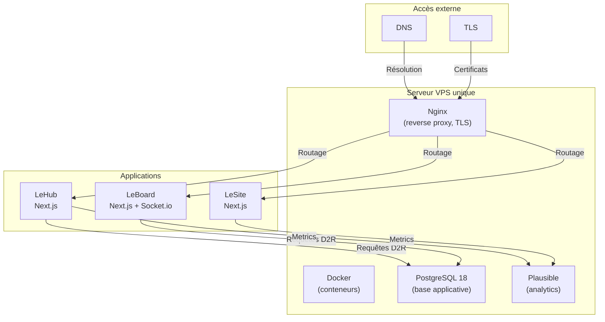

# Infrastructure

## Vue d'ensemble

La Fresque Systémique repose sur une infrastructure cloud simplifiée : un serveur unique (VPS) qui héberge l'ensemble du SI en conteneurs Docker derrière un serveur web Nginx. Les certificats TLS sont gérés automatiquement, et une instance PostgreSQL persiste les données de LeHub et LeBoard.

## Déploiement des applications

### Conteneurs Docker

Chaque application (LeHub, LeSite, LeBoard) s'exécute dans son propre conteneur Docker :

- **Image** : construite depuis le Dockerfile à la racine du repo (`npm ci`, build prod Next.js, serveur Node avec output standalone).
- **Runtime** : Node 20.
- **Accès à la DB** : chaque conteneur reçoit `DATABASE_URL` dans son `.env` pour accéder à PostgreSQL.
- **Volumes** : les fichiers d'upload de LeHub sont montés depuis le système de fichiers de l'hôte (voir ci-dessous).

Un orchestrateur (Docker Compose ou équivalent) gère le cycle de vie des conteneurs sur l'hôte.

### Serveur web Nginx (hôte)

Nginx s'exécute sur l'hôte (pas en conteneur). Il assume plusieurs rôles :

- **Reverse proxy** : redirige les requêtes HTTP/HTTPS vers les conteneurs applicatifs selon le domaine (routage par `Host` header).
- **TLS (HTTPS)** : termine les connexions HTTPS, déchiffre et proxy le trafic vers les apps (en clair en interne).
- **Certificats** : gérés automatiquement, renouvellement transparent.
- **Uploads statiques** : les fichiers d'upload de LeHub sont servis directement par Nginx via un alias de système de fichiers, **non par l'application**.

:::warning Les images d'upload sont servies par Nginx, pas par l'application
Les fichiers d'upload de LeHub sont servis directement par le Nginx de l'hôte via un alias de système de fichiers couvrant tout le préfixe `/uploads`, et non par le conteneur applicatif. Une modification de cette configuration exige un rechargement de Nginx. Les chemins exacts sont dans LeRunbook.
:::

### PostgreSQL 18

Une instance PostgreSQL unique s'exécute sur l'hôte ou en conteneur, accessible via TCP depuis tous les conteneurs d'applications.

- **Données** : tous les ateliers, inscriptions, participants, contenus, badges, ainsi que tous les modèles du plateau LeBoard (`Board`, `CardPlacement`, `BoardLotDistribution`, etc.).
- **Migrations** : appliquées lors du déploiement (job CI/CD `prisma migrate deploy`), qui bloque si une migration échoue. Les rôles gérés par Prisma.
- **Sauvegardes** : sauvegarde régulière (voir page [Sauvegardes](./sauvegardes.md)).
- **Accès hors conteneur** : un administrateur peut se connecter directement pour diagnostic (voir LeRunbook pour les credentials).

### Analytics auto-hébergé (Plausible)

Une instance **Plausible** (outil d'analytics open-source) s'exécute sur l'hôte et collecte les données d'audience :

- **LeHub** : domaine `hub.fresquesystemique.org`.
- **LeSite** : domaine `fresquesystemique.org`.
- **LeBoard** : domaine `board.fresquesystemique.org`.
- **Respect vie privée** : pas de cookie, IP anonymisée, conforme RGPD.
- **Données** : accessibles via interface web admin (voir LeRunbook pour accès).
- **Continuité** : même si Plausible redémarre, les apps restent fonctionnelles (analytics est non-critique).

## Certificats TLS

Les certificats HTTPS sont générés automatiquement et renouvelés sans intervention. Ils couvrent tous les domaines de production (`fresquesystemique.org`, `hub.fresquesystemique.org`, `board.fresquesystemique.org`).

- **Validation** : les certificats sont valides en production et couvrent tous les domaines exposés publiquement.
- **Renouvellement** : le renouvellement est automatique et ne nécessite pas d'action.
- **En cas d'expiration** : si un certificat expire sans renouvellement, les accès HTTPS échouent. Les accès HTTP sont bloqués (redirection HTTPS forcée).

## Résilience et limites

### Limites connues

- **Single Point of Failure** : un seul serveur VPS. Une panne serveur arrête l'ensemble du SI.
- **Capacité** : l'infrastructure actuelle supporte les usages observés (centaines de membres, ateliers mensuels). Une croissance majeure exigerait du scaling (réplicasDB, load balancer, multi-serveurs).
- **Recette en cas de panne grave** : redémarrage manuel du serveur, restauration depuis sauvegarde (voir LeRunbook).

### Sauvegardes

Les données de la base PostgreSQL et des fichiers d'upload sont sauvegardées régulièrement vers un stockage objet externe. Voir la page [Sauvegardes](./sauvegardes.md) pour les détails.

### Monitoring

Un monitoring continu supervise la santé du serveur et des applications. Voir la page [Monitoring](./monitoring.md).
